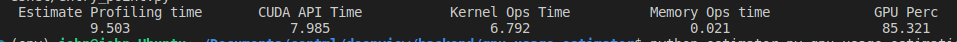

# GPU ESTIMATION

## Overview
This is a script to generate a quick summary of gpu usage for ML models

## Usage
```
python estimator.py gpu-usage-estimation [path_to_file]
```

## Requirements
1. Nsys must be available in your path [info](https://developer.nvidia.com/nsight-systems/get-started)
2. The modules required by your model must be installed in the virtual environment from where you call this file

## Example output
